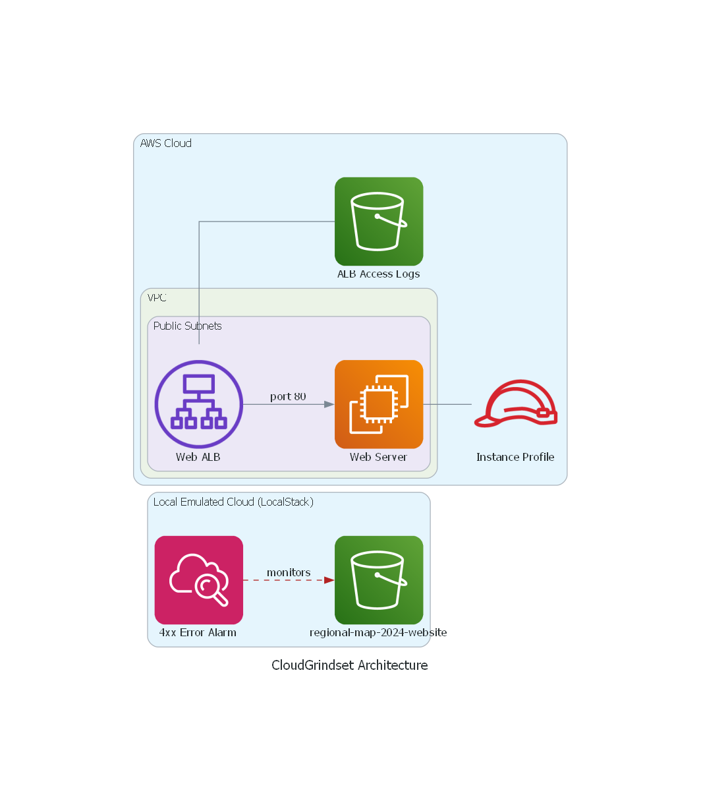

# CloudGrindset 2026: Automated Multi-Stack AWS Environment

A professional-grade, local-first Infrastructure as Code (IaC) laboratory. This project demonstrates the orchestration of a complex AWS environment—including Networking, IAM, Compute, and Storage using Troposphere (Python) and LocalStack instead of real AWS.

## 🏗 Architecture

## 🛠 Built with Diagrams-as-Code
Unlike manual Visio or Draw.io diagrams that go out of date, this project's architecture is generated directly from Python code using the diagrams library.

Automated Updates: Every push to main triggers a GitHub Action runner that regenerates the diagram.

Source of Truth: The infrastructure code and the visual representation are always in sync.

# Project Overview
This repository transitions away from manual AWS Console clicks or even multi-step IaC deployments into a fully automated "Software-Defined Data Center". It utilizes a "Transpile-and-Orchestrate" pattern common in high-scale DevOps environments.

# Deployment Strategy
This project uses a hybrid deployment model to demonstrate professional CI/CD practices:
- LocalStack (Simulation): Every Pull Request triggers a full infrastructure deployment in a GitHub Actions runner. This validates the Troposphere templates and simulates the S3 asset synchronization from a sibling repository (regional-map-2024).
- GitHub Pages (Live): The frontend remains decoupled in its own dedicated repository, ensuring high availability and independent versioning.

# Key Features

- Programmatic IaC: Infrastructure defined in Python using Troposphere, allowing for loops, logic, and validation before YAML generation.

- Automated Orchestration: A custom deployment engine handles stack dependencies (e.g., ensuring Networking exists before EC2 attempts to join a Subnet).

- CI/CD Integration: GitHub Actions automatically validates and deploys the entire stack to a headless LocalStack environment on every push.

- Full Lifecycle Management: One-click deployment (deploy_all.sh) and one-click teardown (cleanup.sh).

# Tech Stack

- Language: Python 3.12 (Troposphere library)

- Cloud Provider: AWS (emulated via LocalStack)

- DevOps CI/CD: GitHub Actions, Bash Shell

- Services: VPC, EC2, S3, DynamoDB, IAM, CloudWatch

# Getting Started

Prerequisites

Python 3.12+ and a virtual environment.

Docker (Required for LocalStack).

AWS CLI (Configured with dummy credentials for local use).

1. Initialize the Environment

Bash

# Clone the repository

git clone https://github.com/CapoMK25/CloudGrindset2026.git
cd CloudGrindset2026

# Set up the virtual environment

python -m venv .venv
source .venv/scripts/activate  # Or .venv/bin/activate on Linux/Mac
pip install -r requirements.txt

# Start the local cloud
localstack start -d

2. The "One-Click" Deployment
Run the master orchestration script. This will transpile Python templates to YAML and deploy them to LocalStack in the correct dependency order.

Bash
./lab_scripts/deploy_all.sh

3. Verify the Deployment
Check the status of your stacks directly through the AWS CLI:

Bash
aws --endpoint-url=http://localhost:4566 cloudformation list-stacks --stack-status-filter CREATE_COMPLETE
📂 Project Structure
iac/: Python scripts (Troposphere) defining AWS resources.

yaml/: Auto-generated CloudFormation templates (Git-ignored in production, kept here for reference).

lab_scripts/: Orchestration logic and lifecycle management.

.github/workflows/: CI/CD pipeline definitions.

# Cleanup
To avoid resource leakage and reset your local environment:
Bash
./lab_scripts/cleanup.sh

# Engineering Notes
This project solves the "Dependency Hell" problem in CloudFormation by utilizing a sequential deployment script. By exporting values in the networking stack (like VPCID and PublicSubnetID), the ec2 stack can dynamically import them at runtime, ensuring a loosely coupled yet highly integrated architecture.
